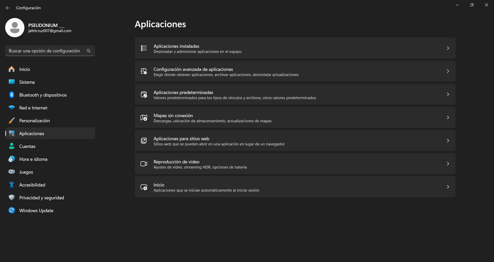

# MANUAL DE DESCARGA E INSTALACION DE PHYTON
## DESCARGA DE PYTHON DESDE EL SITIO OFICIAL
Descargar el lenguaje de programación **python** es relativamente sencillo.

Utilizando el navegador que más es de agrado, de manera intuitiva se escribe el nombre del lenguaje de programación ya sea **PYTHON** o algun otro lenguaje.

Entre los múltiples sitios que se muestran se buscan la página oficial del lenguaje. Posterior a la ubicación del sitio nos adentramos a este.

---
Aquí dentro de la página oficial del lenguaje se presentan distintos apartados y cada uno cuenta con distintas herramientas para el usuario, al seleccionar la pestaña de **descargas** (downloads) el sitio muestra en primera instancia la versión de python más estable y actual para el sistema de Windows.

---
Al acceder al apartado para Windows, se proporcionarán múltiples versiones de **Python**, ya sea para dispositivos de 64 o 32 *bits*.

Se elije una de las versiones compatibles y seguido de ello se inicia su descarga.

---
Finalmente, completada la descarga se ejecuta el archivo y se habilitan ambas opciones que se muestran, y a si se selecciona la opción de intalar ahora.
Estas opciónes permitirán utilizar el lenguje desde el símbolo del sistema, así como habilitar el intérprete de **Python**.

## CAMBIO DE VARIABLE
Para habilitar las variables de entorno que se utilizan en **Python** se accede al menú de ajustes del sistema, seguido de ello se buscan las aplicaciones instaladas en el apartado de aplicaciones.

---
En la barra de búsqueda se escribe el nombre del lenguaje y se selecciona *Python 3.13.1 (la versión que se tiene instalada)*, al dar clic en los tres puntos de la esquina superior derecha de la aplicación se proporcionara la opcion de modificar a la cual se accedera.

---
La aplicación proporciona una interfaz con tres apartados, se accede a **Modify** para posteriormente realizar los ajustes necesarios para las variables de entorno.

---
Continuamos sin modificar nada en este apartado.

---
Finalmente se habilitan las opciones 3 y 4, en caso de estar ya habilitadas directamente se procede a instalar.

---

